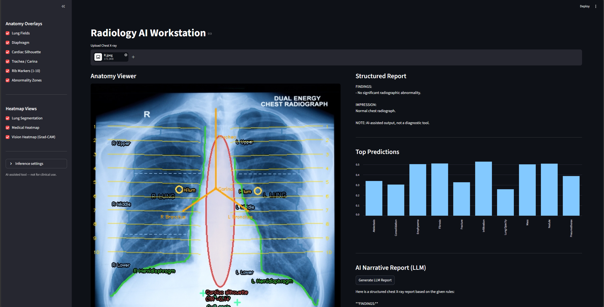
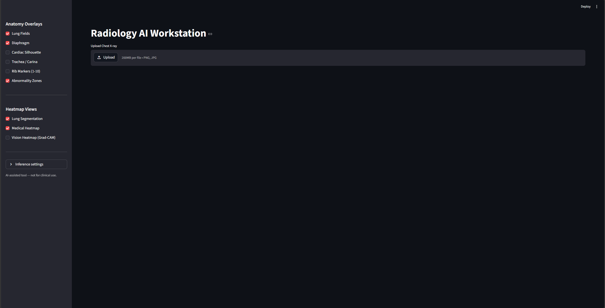
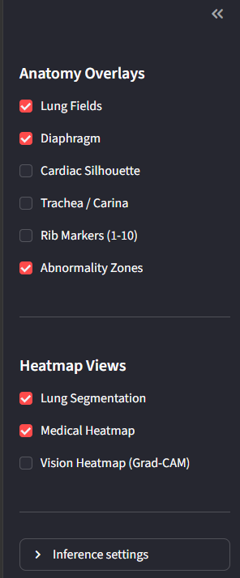
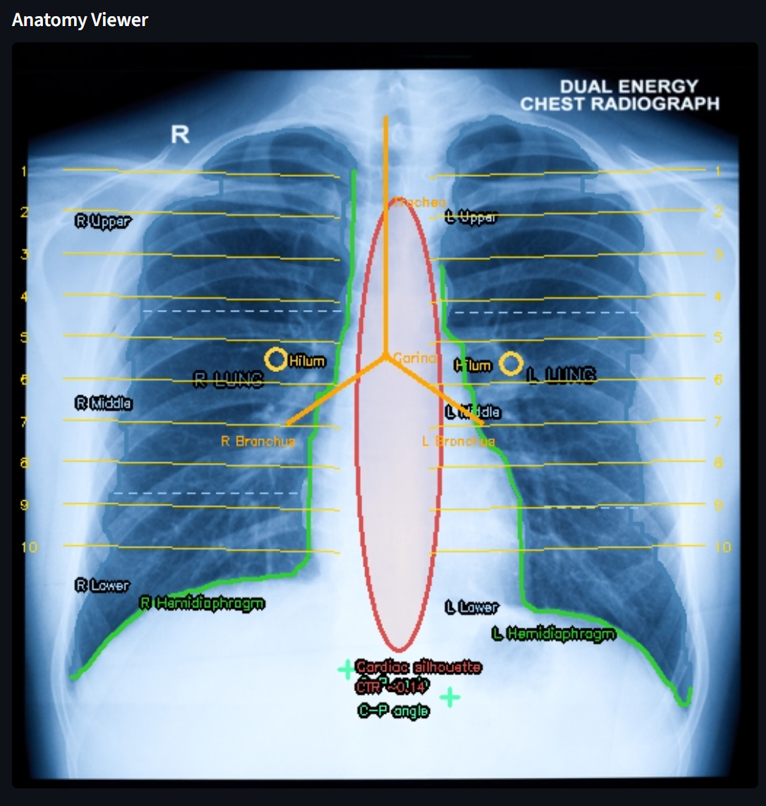
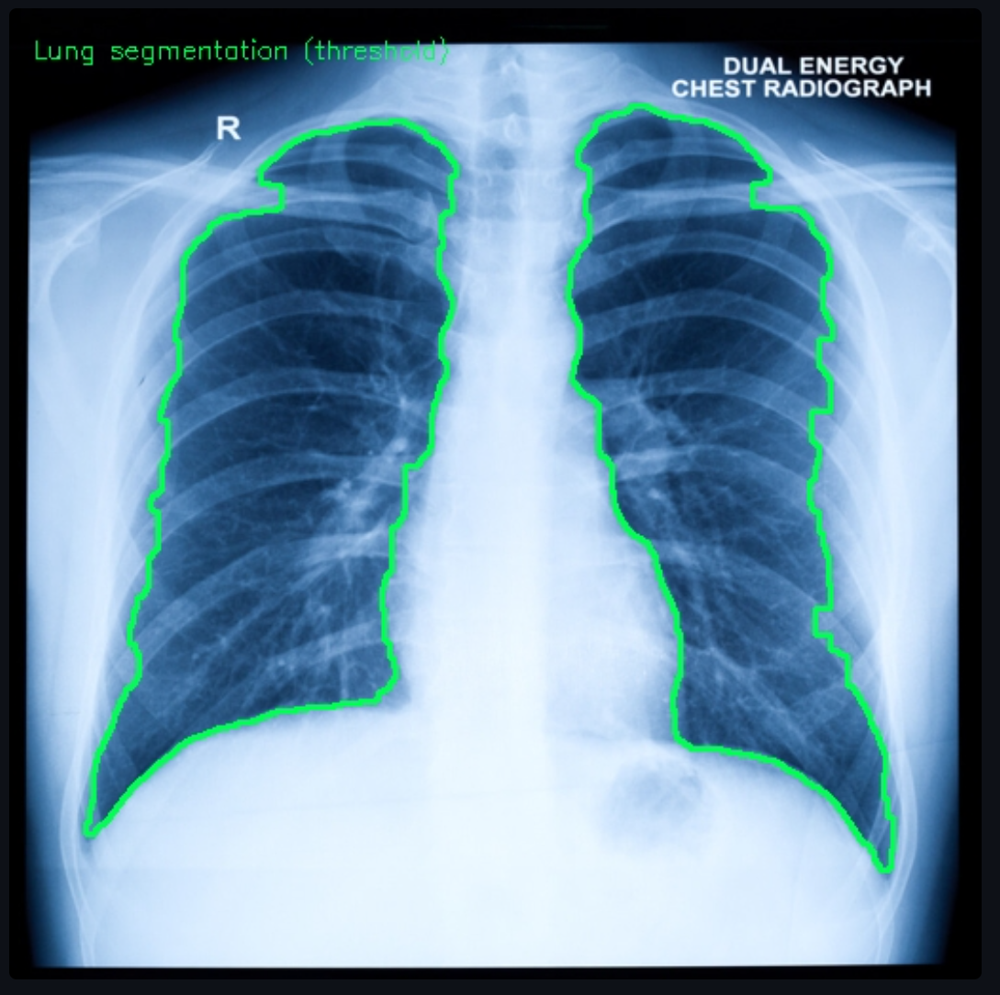
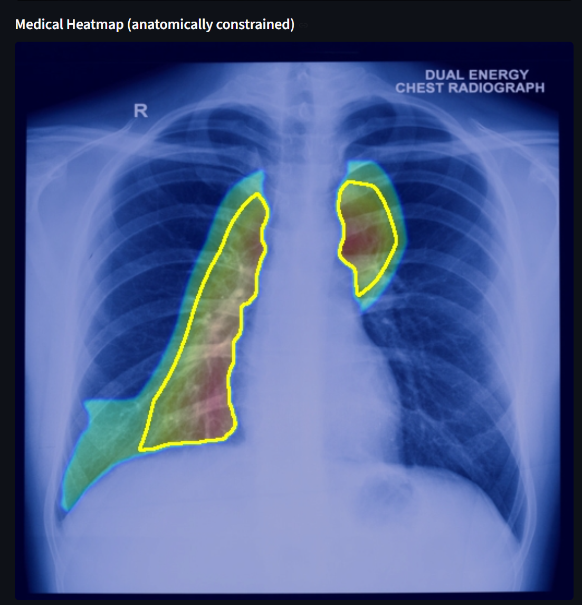
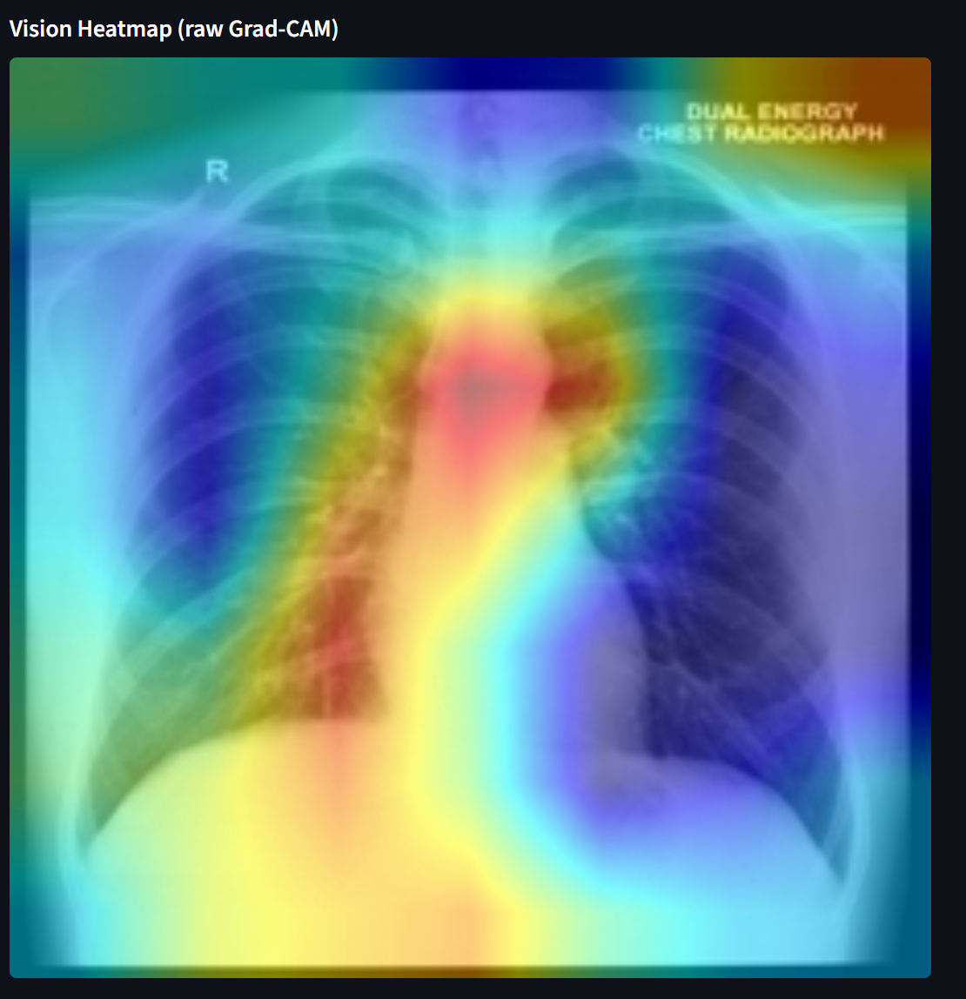

# Radiology AI Workstation

## 1. Project summary
I built this project as a local chest X ray proof of concept that can run on a personal machine.
The goal is not only prediction, but also visibility into how the model reached a result.
That is why the app includes Grad CAM, lung constrained heatmaps, anatomy overlays, and report generation in one place.

This repository is currently focused on chest radiology.
The design is modular enough to extend later, but this version is intentionally scoped so it stays testable and understandable.

This prototype was put together in a few hours to prove that this kind of workflow is possible even at small scale on consumer hardware.
The broader idea is not that this version is finished, but that the foundation is already visible.
With the right financing, the right datasets, proper engineering time, and more specialized tooling, this could be pushed much further.

Another goal here was to test the workflow first and then decide what should be fine tuned next.
At the moment the system uses general chest radiology models rather than models tuned for one exact clinical task or one carefully curated dataset.
That means it can produce interesting outputs, but it is not yet as precise, reliable, or specialized as a medical grade system would need to be.

## 2. What is already implemented
1. Streamlit web interface for chest X ray upload and review.
2. DenseNet inference with confidence scores for multiple chest findings.
3. Grad CAM visual attention map.
4. Threshold based lung mask generation per image.
5. Anatomically constrained medical heatmap using lung mask multiplication.
6. Anatomy overlay layers that can be enabled and disabled from sidebar controls.
7. Structured report text generated from prediction rules.
8. Optional LLM narrative report through Ollama.

## 3. What each file and folder is used for
1. app.py
Main Streamlit application and end to end inference workflow.

2. anatomy_overlay.py
Anatomy drawing functions, lung mask logic, constrained heatmap builder, and medically grounded overlay composition.

3. PIPELINE.md
Pipeline explanation and conceptual flow.

4. datasets
Dataset storage for future training and evaluation steps.

5. models
Local model assets and custom checkpoints.

6. notebooks
Exploration notebooks and experiment notes.

7. uploads
Input image staging.

8. outputs
Generated artifacts and result exports.

9. Screenshots
UI captures for portfolio and documentation.

10. BACKUPS
Older app versions and historical experiments.

## 4. Pipeline walkthrough in plain language
1. The user uploads a chest X ray.
2. The app creates a model input view at 224 by 224 and a larger display view for overlays.
3. DenseNet inference runs and returns probabilities for pathology labels.
4. Results are sorted, then filtered by confidence threshold and top finding limit.
5. Grad CAM is generated from the model target block.
6. A lung mask is estimated from image intensity using Otsu thresholding, flood fill cleanup, morphology, and area filtering.
7. The Grad CAM map is resized and multiplied by the lung mask to suppress out of lung activation.
8. Weak activations are removed and the map is smoothed and colorized.
9. Contours are extracted from higher activation zones and drawn on the display image.
10. Anatomy layers are rendered on top of the image according to sidebar selection.
11. A structured report is generated from top findings and grouped clinical patterns.
12. If requested, findings are sent to Ollama for a narrative report.

## 5. Screenshots
### App overview







### Core visual outputs










These screenshots show the current state of the prototype.
They are useful for understanding the workflow, but they should not be read as exact medical localization or exact anatomy tracing.
Some visual elements are image derived and some are still geometric approximations.
That is intentional for this proof of concept stage.

## 6. Local setup on Windows step by step
1. Open PowerShell in the repository root.
2. Create a virtual environment if you do not already have one.

```powershell
python -m venv venv
```

3. Activate the environment.

```powershell
venv\Scripts\Activate.ps1
```

4. If script execution is blocked, allow it for the current shell session.

```powershell
Set-ExecutionPolicy -Scope Process -ExecutionPolicy RemoteSigned
```

5. Install required packages.

```powershell
pip install -r requirements.txt
```

6. Verify core imports.

```powershell
python -c "import streamlit, PIL, numpy, torch, cv2, torchxrayvision; print('ok')"
```

7. Start the web app.

```powershell
streamlit run app.py
```

8. Open the local URL printed by Streamlit.

## 7. How to run a full test pass
1. Start the app.
2. Upload a clean frontal chest X ray.
3. Keep default threshold first, then adjust only after first pass.
4. Check Anatomy Viewer for overlay quality.
5. Check Lung Segmentation panel and verify lungs are mostly captured.
6. Check Medical Heatmap and compare with raw Vision Heatmap if needed.
7. Read Structured Report and compare with top prediction bars.
8. If Ollama is available, generate the narrative report.
9. Save screenshots for repository examples.

## 8. Troubleshooting
### 7.1 App does not launch
1. Confirm you are in the repository root.
2. Confirm the environment is active.
3. Confirm Python and pip point to the active environment.

```powershell
python --version
pip --version
```

4. Run the app again.

```powershell
streamlit run app.py
```

If needed do this
Reinstall Streamlit and rerun.

```powershell
pip install --upgrade streamlit
```

### 7.2 Module not found errors
1. This usually means the command ran outside the virtual environment.
2. Reactivate the environment and install missing packages.

```powershell
venv\Scripts\Activate.ps1
pip install -r requirements.txt
```

If needed do this
Install package by package to identify the one failing on your machine.

### 7.3 CUDA is not used
1. Check if PyTorch sees CUDA.

```powershell
python -c "import torch; print(torch.cuda.is_available())"
```

2. If result is False, the app still works on CPU but slower.

If needed do this
Install the correct CUDA enabled PyTorch build from official PyTorch instructions and test again.

### 7.4 Grad CAM crashes or returns empty output
1. Confirm model loading succeeds without errors.
2. Confirm the selected target layer exists for the loaded model.
3. Restart the app after package updates.

If needed do this
Upgrade Grad CAM package.

```powershell
pip install --upgrade grad-cam
```

### 7.5 Ollama report generation fails
1. Confirm Ollama is installed.
2. Confirm the model exists locally.

```powershell
ollama list
```

3. Pull the model if missing.

```powershell
ollama pull llama3.1
```

4. Retry report generation from the app.

If needed do this
Close and restart Ollama service, then run the app again.

### 7.6 Segmentation looks wrong
1. Very low quality, rotated, or non chest images can break threshold segmentation.
2. Verify image type first before adjusting thresholds.
3. Compare Lung Segmentation and Medical Heatmap together before interpretation.

If needed do this
Test with a different image from the same source and compare results.

### 7.7 Streamlit page opens but output is not updating
1. Check terminal for runtime traceback.
2. Refresh browser page once.
3. Stop app and run it again.

```powershell
streamlit run app.py
```

If needed do this
Clear browser cache for localhost and reopen the app URL.

## 9. Hardware reality and why limits matter
This project was tested as a lightweight proof of concept rather than a full training pipeline.
Consumer hardware is enough to demonstrate inference, overlays, and reporting, but it still comes with tradeoffs.

For example, an RTX 3060 Ti with 8 GB of VRAM is enough for this kind of prototype, especially for inference and smaller experiments.
It is not ideal for large scale medical training, large segmentation models, or more demanding multimodal workflows.
That matters because model quality in medical imaging is heavily tied to data quality, annotation quality, and the ability to train and validate properly over time.

In practice, limited hardware means smaller experiments, more careful memory use, and slower iteration on fine tuning.
It does not prevent proof of concept work, but it does limit how quickly a project can move toward robust clinical level performance.

## 10. Practical notes before publishing
1. Check that the screenshots render correctly on GitHub.
2. Make sure one normal looking case and one abnormal looking case are shown.
3. Keep the medical disclaimer visible in README and in app UI.
4. If Ollama is optional for your audience, say it clearly so setup stays smooth.

## 11. Safety statement
This is a research and portfolio project.
It is not a medical device.
It is not validated for clinical diagnosis.
It should not be used as a standalone clinical decision system.

The current outputs can be useful for experimentation and discussion, but they are not 100 percent accurate and should not be presented as perfected or medically approved.
Reaching that level would require much more focused model training, validation on proper datasets, stronger evaluation, and clinical review.

## 12. Current limitations
1. Lung segmentation is threshold based and can fail on difficult studies.
2. Grad CAM provides weak localization, not pixel accurate lesion segmentation.
3. The system does not include DICOM workflow in the current version.
4. Clinical validity has not been established.
5. The base models are common radiology models and are not yet fine tuned for this exact workflow.
6. Some anatomy overlays and highlighted details are approximate rather than exact.
7. Visual results in the screenshots should be read as prototype outputs, not final diagnostic quality results.

## 13. Roadmap
1. Replace threshold mask with trained lung segmentation model.
2. Add evaluation scripts and saved metrics on held out data.
3. Add DICOM input and basic window controls.
4. Fine tune models on better targeted datasets once the workflow is stable.
5. Improve modular design for specialty packs after chest workflow is stable.

## 14. License and contributions
This project is released under a BSD 4-Clause style attribution license.
People can use, modify, and redistribute the work, but they must keep the license terms and include the required acknowledgement when they advertise or publicly mention software built from it.

The acknowledgement text is included in the LICENSE file.
In simple terms, use is allowed, but visible credit is required.

If contributions are welcome, add a short contribution guide with local setup, coding style, and test expectations.
